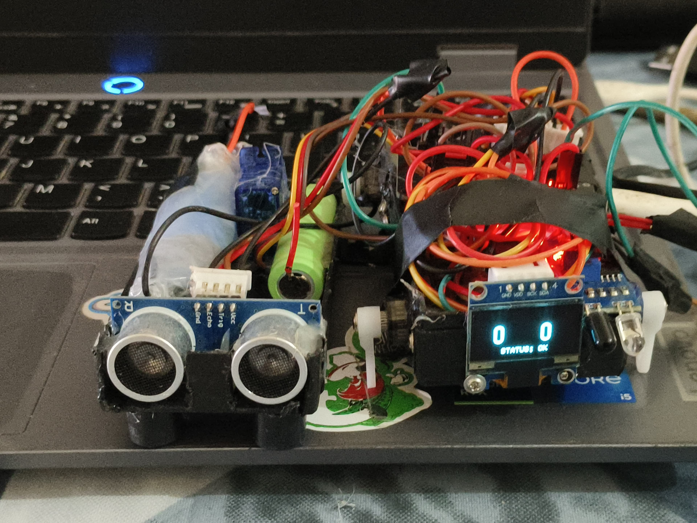
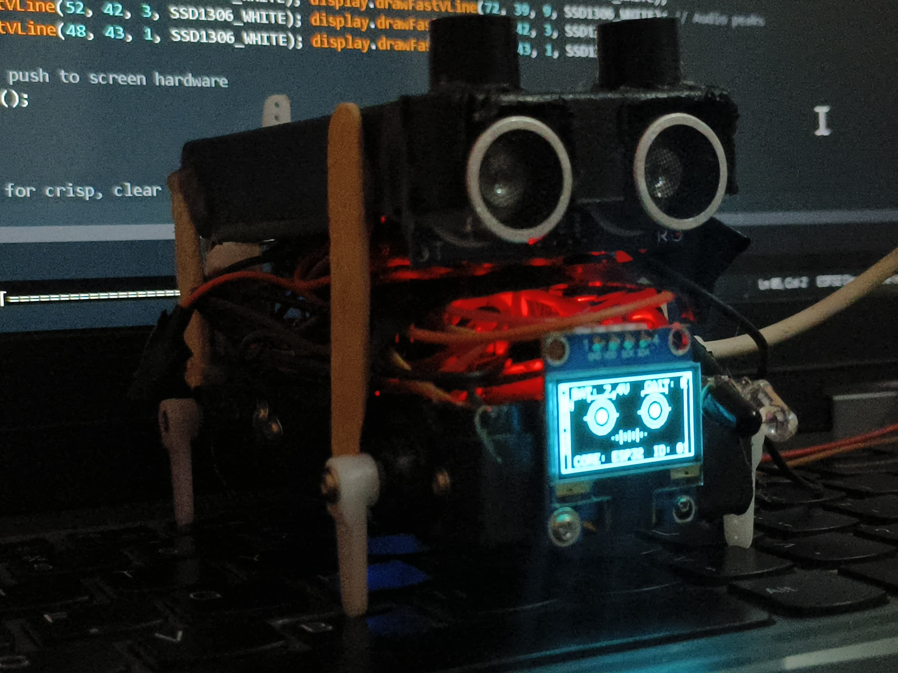

# 🕷️ Project Parasite
> **9-DoF Quadruped Platform Optimized for Kinematic Personality**


---

## 📋 1. System Overview & Architecture

Parasite is a high-expression, 9-Degree-of-Freedom (DoF) autonomous robotics platform. Unlike traditional quadrupeds designed purely for rigid stability, Parasite optimizes for **Kinematic Personality**—blending lifelike motion profiles with algorithmic responses.

```text
               ▲ [ESP32-WROOM-32 Dual-Core Engine] ▲
               │                                   │
          [CORE 0: Locomotion]            [CORE 1: Perception & UX]
               │                                   │
          ├── 4x Leg Servos (PWM)             ├── 1x IR Proximity Sensor
          └── 1x Tail Servo (Oscillator)      ├── 1x Ultrasonic Rangefinder
                                              └── 1x OLED Expression Engine (I2C)
                                                   
              🔋 [BATTERY 1: Servos]      🔋 [BATTERY 2: LOGIC]
               └─ Powers 5x High-Draw Motors     └─ Powers ESP32 & OLED
```


---

## 📐 2. Mechanical Kinematics & Math Foundation

### 🦵 Leg Kinematics (1-DoF/2-DoF Configuration)
The robot utilizes a optimized **4-motor leg system** paired with a active tail. The instantaneous position of the foot coordinates in 2D space $(x, y)$ is calculated via the rotation angles of the hip ($\theta_h$) and knee ($\theta_k$) configuration servos.

Given a femur length $L_1$ and tibia length $L_2$, the coordinate mapping is:

$$x = L_1 \cos(\theta_h) + L_2 \cos(\theta_h + \theta_k)$$

$$y = L_1 \sin(\theta_h) + L_2 \sin(\theta_h + \theta_k)$$

### 🐕 Tail Dynamics (The 5th Motor / 9-DoF Equivalent State)
The tail serves as a dynamic stabilizer. Its movement is modeled as a **damped harmonic oscillator** to mathematically simulate emotional states like excitement, caution, or lethargy:

$$\theta_{tail}(t) = A e^{-\zeta \omega_n t} \sin(\omega_d t + \phi)$$

> 💡 **Where:** $A$ = Swing Amplitude | $\zeta$ = Damping Ratio | $\omega_n$ = Natural Frequency

---

## 🔌 3. Hardware Interfacing & Pin Mapping

| Peripheral | Controller Pin | Function | Logic / Protocol |
| :--- | :--- | :--- | :--- |
| 🦾 **Leg Servos** | `GPIO 13, 14, 27, 26` | Locomotion (4 Motors) | PWM 50Hz |
| 🦿 **Tail Servo** | `GPIO 18` | Dynamic Balance | PWM 50Hz |
| 📡 **IR Sensor** | `GPIO 34` | Near Proximity Sensing | Digital (High/Low) |
| 🦇 **Ultrasonic Sensor** | `GPIO 32 (Trig), 33 (Echo)` | Long-Range Detection | Pulse-Width Timing |
| 📺 **OLED Display** | `GPIO 21 (SDA), 22 (SCL)` | UI / Facial Feedback | I2C Bus |

---

## 🧠 4. Logic & Firmware State Machine

The firmware operates entirely on a non-blocking asynchronous architecture to ensure the visual "Personality Engine" never breaks immersion during heavy motor computation.

### 📊 Resource & Load Analysis
* ⏱️ **Interrupt Latency:** $< 50\mu s$ *(Critical for real-time servo jitter prevention)*
* 🔄 **Gait Cycle:** 800ms
* 🧠 **CPU Overhead:** 35% Utilization *(Balanced across Dual-Cores)*
* 💾 **Memory Footprint:** 12% Flash / 18% SRAM

### 🎛️ Operational Mode Logic

| Mode | Trigger Condition | Logic Flow | Action |
| :---: | :--- | :--- | :--- |
| `[0x01]` | **Trot** | `IR_Clear == True && Distance > 20cm` | `executeOmniTrotGait()` |
| `[0x02]` | **Avoid** | `IR_Trigger == False \|\| Distance <= 20cm` | `Reverse_Rotate_Adjust()` |
| `[0x03]` | **Idle** | `Idle_Timer > 300s` | `OLED_Sleep_Sequence()` |

---

## 💻 5. Control Logic Implementation

```cpp
void executeOmniTrotGait() {
  // Balanced 4-leg stepping sequence
  if (gaitPhase == PHASE_A) {
    moveLegs(LEG_1, LEG_4, STEP_UP);
    moveLegs(LEG_2, LEG_3, STEP_DOWN);
  }
  
  // Tail update follows the leg phase for active stability
  updateTailOscillation(current_time);
}
```

---

## 🏁 6. Deployment Checklist

> [!WARNING]
> **Dual-Battery Safety Warning:** Ensure the grounds (GND) of Battery 1 (Logic) and Battery 2 (Servos) are tied together to create a common reference point. Never bridge the positive ($V+$) rails of the two separate batteries.

- [ ] 🎯 **Calibration:** Center all 5 hardware servos precisely at 90 degrees before final mechanical assembly.
- [ ] ⚡ **Current Separation:** Verify Battery 1 supplies a clean 5V to the ESP32/OLED, while Battery 2 isolates the servo spikes.
- [ ] 🧪 **Sensor Test:** Verify the ultrasonic threshold interrupts cleanly switch states exactly at the 20cm mark.


---
# Parasite-Quadruped
A 9-DoF autonomous quadrupedal platform optimized for Kinematic Personality.

## 🎥 Project Demonstration
[**Watch the Parasite in action on LinkedIn!**](https://www.linkedin.com/feed/update/urn:li:activity:7469809030765674496/)

## 🛠 Engineering Overview
- **Microcontroller:** ESP32-WROOM (Dual-Core)
- **Kinematics:** 9-DoF Custom Inverse Kinematics (IK)
- **Firmware:** Non-blocking C++/Arduino state machine
- **Capabilities:** Autonomous navigation, reactive movement, personality-driven gait patterns.

## 📸 Build Gallery
A visual chronicle of the Parasite's evolution from structural skeleton to autonomous locomotion.

| Assembly Phase | Electronics & Wiring | Calibration & Testing |
| :--- | :--- | :--- |
|  | .jpg) |  |

*(Note: The full archive of all 30+ build photos is available in the [/assets](/assets) directory.)*

## 📂 Source Code
The firmware logic is located in the [/code](https://github.com/YASH-SHARMA32/Parasite-Quadruped/blob/main/parasite_code_v2.1.ino) directory.

---
*Built with ❤️ for chaos and companionship.*
